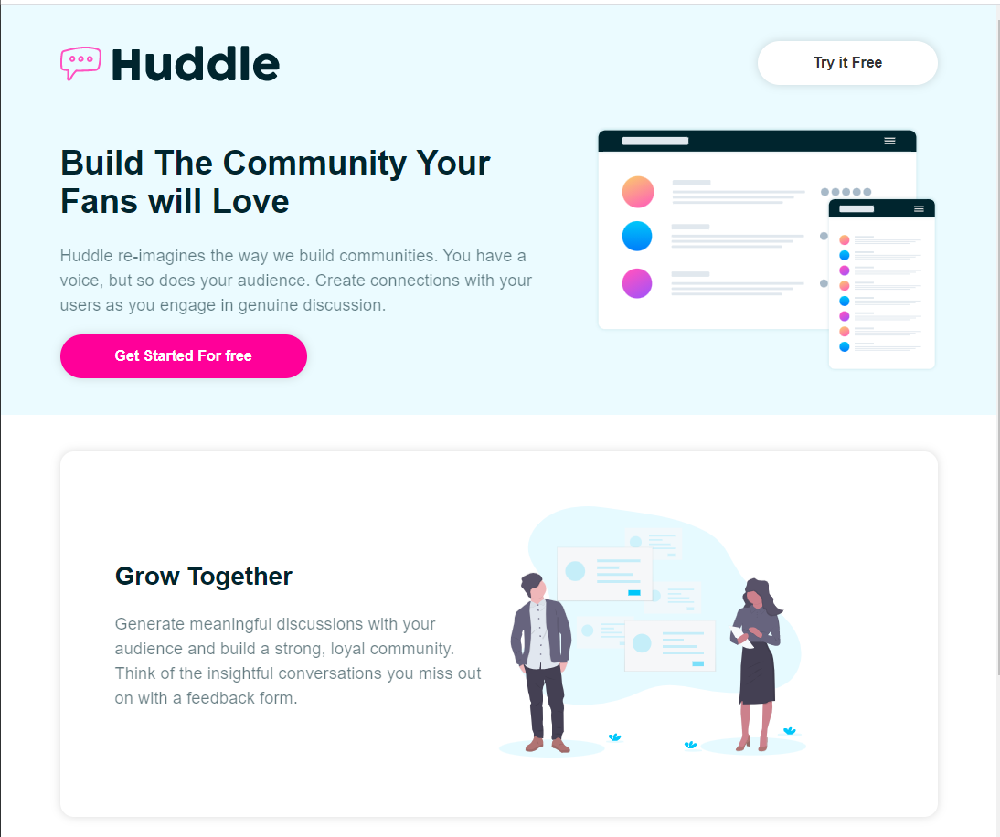
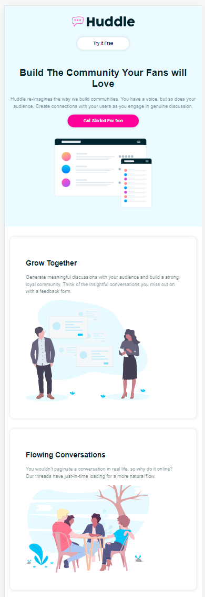

# Project Title

Project for styled-components responsive Website


## Tech Stack

**Client:** react,styled-components 5.3.1

**Server:** No

  
## Features

- test
- test
- test
  
  
## Screenshots




<!--  -->


  
## Demo

Insert gif or link to demo

  
## Installation

Install my-project with npm

```bash
  cd my-project
  yarn install 
```
    
## Deployment

To deploy this project run

```bash
  yarn test
```

  
## Run Locally

Clone the project

```bash
  git clone https://link-to-project
```

Go to the project directory

```bash
  cd my-project
```

Install dependencies

```bash
  yarn install
 
```

Start the server

```bash
  yarn start
```

  
## Usage/Examples

```javascript
import Component from 'my-project'

function App() {
  return <Component />
}
```

  
## Running Tests

To run tests, run the following command

```bash
  yarn test
```

  
## Documentation

[Documentation](https://linktodocumentation)

  
## Support

For support, email test@test.com or join our Slack channel.

  
## Roadmap

- Additional browser support

- Add more integrations

  
## Appendix

Any additional information goes here

  
## Acknowledgements

 - [Awesome Readme Templates](https://awesomeopensource.com/project/elangosundar/awesome-README-templates)
 - [Awesome README](https://github.com/matiassingers/awesome-readme)
 - [How to write a Good readme](https://bulldogjob.com/news/449-how-to-write-a-good-readme-for-your-github-project)

  
## Lessons Learned

What did you learn while building this project? What challenges did you face and how did you overcome them?

  
## Feedback

If you have any feedback, please reach out to us at test@test.com

  
## Authors

- [@Inokcode](https://github.com/Inokcode)

  